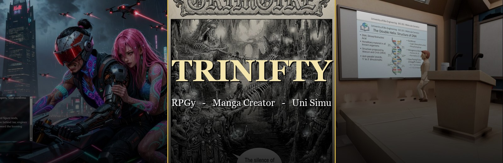
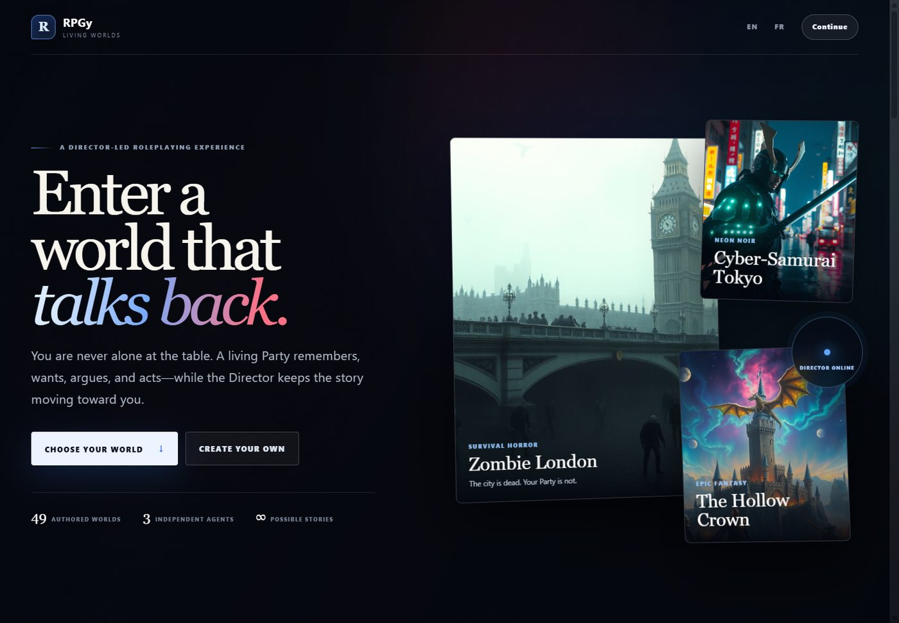
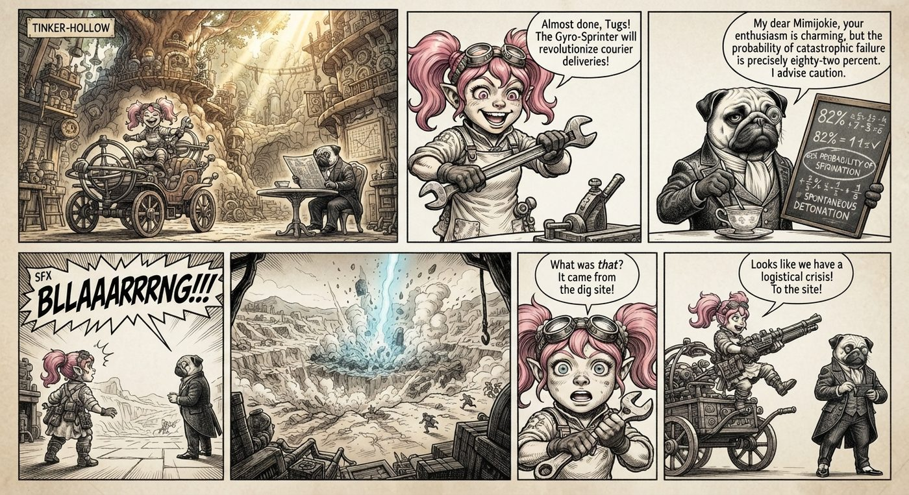
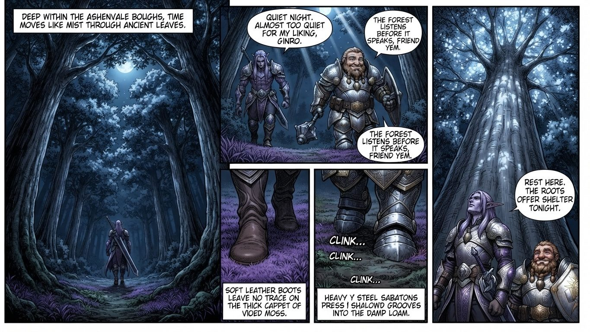
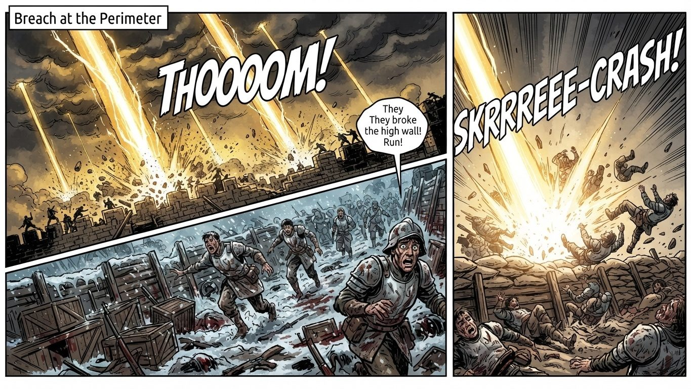
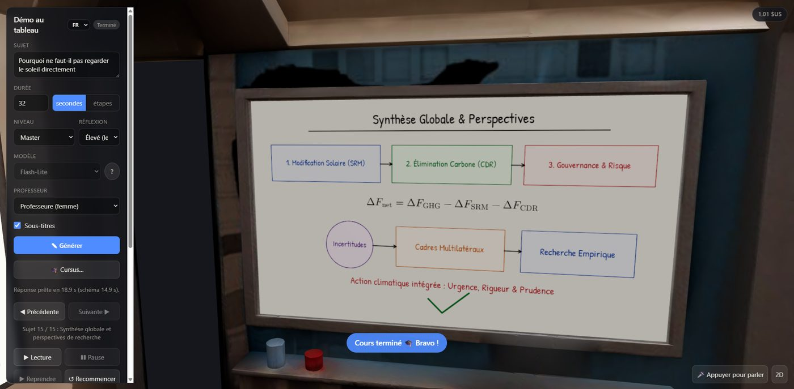

# Trinifty - all nifty stuff - all for free

<p align="center">
  
</p>

<p align="center">
  <b>Three open-source creative engines. One idea: AI should hand you the keys, not a subscription.</b><br>
  <sub>Play infinite worlds · Draw whole manga · Sit in a lecture that adapts to you</sub>
</p>

<p align="center">
  <a href="https://www.patreon.com/c/PierreIgorZarebski"></a>
  
  
  
</p>

---

## You just found something precious

I build the kind of software I always wished existed: tools where **a single sentence from you becomes a world, a graphic novel, or a university course**.

Not demos. Not "free trials". Not "3 generations then pay". Real, working apps, with real art on screen, that you can run, read, fork and bend to your will, **for free**.

Together they make a **trifecta** (a *"trifacta"* if you ask me):

| | Project | You type... | You get... |
|---|---|---|---|
| 🎲 | **[RPGy](#-rpgy--a-world-that-talks-back)** | *"Rain-soaked occult noir in 1920s Marseille..."* | A living, illustrated RPG with a Party that argues back |
| 📖 | **[Manga Creator](#-manga-creator--from-one-sentence-to-a-50-page-graphic-novel)** | *"A gnome engineer and her very smart pug..."* | A finished 50-page graphic novel with consistent characters |
| 🎓 | **[Uni Simu](#-uni-simu--learn-with-ai-the-hard-way)** | *"Explain how sunlight travels from the Sun to Earth"* | A professor who writes it on the whiteboard, live, in 3D |

> **Scroll on.** Every section below has real screenshots. Everything you see was generated and rendered by the tools themselves.

---

## 🎲 RPGy - *a world that talks back*

> *"You are never alone at the table. A living Party remembers, wants, argues, and acts, while the Director keeps the story moving toward you."*

<p align="center"></p>

RPGy is a **text-RPG engine with a Game Master brain**. You describe any setting, and it builds the world, your character, your companions and the opening crisis, then illustrates every scene as you play.

**What makes it special**

- 🌍 **49 authored worlds** ready to play: zombie London, cyber-samurai Tokyo, Mars colonies, wizard academies, Roman frontiers, post-apocalyptic wastelands...
- 🛠️ **World Constructor**: write one *Master Prompt* and the Director drafts every field (genre, tone, stakes, first choice, hero art). Tweak anything before reality is built.
- 🧑‍🤝‍🧑 **A living Party**: companions have personalities, relationship scores, and *interject on their own*. You can open a private chat with any of them.
- ⚖️ **Karma-morphing world**: your choices secretly reshape the world. Be ruthless and the black markets open; be merciful and doors unlock.
- 🧠 **Truth lives in code, not in the AI**: HP, inventory, map and quests are tracked by the engine, so the story can't "forget" you're wounded. The AI narrates; the rules stay honest.
- 🕸️ **Procedural spider-web map**: new locations unlock as you explore.
- 💀 **No Game Over**: fall in battle and you're captured, robbed or rescued, then the story *continues*.
- 🖼️ **Every scene illustrated**, photoreal or cartoon, with a portrait for you and each companion.
- 🎵 Optional AI-voiced characters and generated music.
- 💾 **Save / Load** as a plain `.json` file, or **copy a share link** and send your world to a friend.
- 🌐 **English & French**.

<table>
  <tr>
    <td width="50%"><br><sub><b>Zombie London.</b> Your Party sits on screen, each with HP, role and a Chat button.</sub></td>
    <td width="50%"><br><sub><b>Cyber-Samurai Tokyo.</b> Drones, neon, and a companion whispering "Scan confirms: heavy security."</sub></td>
  </tr>
</table>

<p align="center"><br><sub>One of the 49 worlds: a lone astronaut, a red sun, a dome that hides secrets.</sub></p>

**Under the hood:** vanilla JavaScript + Tailwind front end, serverless functions, Google Gemini for story and images. Deploys to Vercel in minutes.
👉 **Repo:** [RPGy](https://github.com/yeme-oss/RPGy) · **Play:** [rpgy.app](https://www.rpgy.app/)

---

## 📖 Manga Creator - *from one sentence to a 50-page graphic novel*

> *"Death is a courtesy the living invented to excuse forgetting. I am merely what remains when the excuse is gone."*
> , Malacor the Sorrowful, from **Grimoire**, a 50-page dark-fantasy novella made entirely with this tool.

<p align="center"></p>

Manga Creator is a **studio**, not a prompt box. It manages whole projects: story bible, character reference sheets, and page-by-page generation, so a character drawn on page 3 still *looks like themselves* on page 47.

**What makes it special**

- 📚 **Multi-project workspace**: each story gets its own folder with `references/` and `pages/`.
- 🧬 **Character reference sheets**: generated once, then automatically fed back in whenever a character is named in a page prompt. That's how faces stay consistent.
- 📜 **Story bible**: write (or generate) the full script, split into movements, with tone, key visuals and dialogue.
- 🖋️ **Real page generation**: panels, speech bubbles, SFX lettering, title banners.
- 📐 **Aspect ratios** 1:1 · 3:4 · 4:3 · 9:16 · 16:9, enforced by a smart center-crop so every page is exactly the format you asked for.
- 🌐 **Text in English or French**, with correct accents.
- 📖 **Built-in reader** with zoom, so you can *read* your book like a book.
- 🔑 Bring your own Gemini key. Your pages are saved to your disk, as plain JPEGs.

### Four books, made with it

<table>
  <tr>
    <td width="50%"><br><sub><b>Mimijokie & Mr. Tugs.</b> A pink-ponytailed gnome engineer and a pug who calculates the odds of her inventions exploding (82%).</sub></td>
    <td width="50%"><br><sub><b>Les Sauvageons de Sombrivage.</b> Moonlit forests, a dark elf and a dwarf. Written in French.</sub></td>
  </tr>
  <tr>
    <td colspan="2"><br><sub><b>Echo of Ash.</b> War, ash and golden light: <i>"They broke the high wall! Run!"</i></sub></td>
  </tr>
</table>

### The twist behind *Grimoire*
Most tragedies begin with life and descend into decay. **Grimoire runs backwards**: it opens on a terrifying skeletal necromancer in a drowned abyss, and with every chapter strips away a layer, until page 50 reveals that the "monster" is the world's most solitary archivist, who gave up peace so that forgotten people would never be erased. 50 pages. 5 movements. Zero shortcuts.

👉 **Repo:** [Manga-Creator](https://github.com/yeme-oss/Manga-Creator)

---

## 🎓 Uni Simu - *learn with AI the hard way*

<p align="center"></p>

Uni Simu is a **university-lecture simulator**. You sit in a 3D auditorium. A professor walks to the board, **writes and draws by hand**, flips through slides, and *talks*, on **any subject, at any level**, from curious teenager to Master's degree.

And then, because real learning is active:

- ✋ **You can ask questions** mid-lecture (push-to-talk) and the professor answers with a *new* board, on the spot.
- 🧪 **Quizzes** to check you actually understood.

**What makes it special**

- 🖍️ **Live whiteboard**: diagrams, arrows, curves from functions, boxes, and **real typeset math (MathJax)**, drawn stroke by stroke in handwriting.
- 🖼️ **Slideshow mode**: generated slide images, speech synced to each slide.
- 🗂️ **Cursus**: ask for an entire *course* and it plans the parts, teaches them in order and tracks your progress.
- 🧑‍🏫 **Male or female professor**, fully rigged and animated in 3D (Three.js), with **natural AI voices** and subtitles.
- 🎚️ **Difficulty & duration dials**: 30-second primer or full session. Level from beginner to Master.
- 🧾 **Live cost meter**: you always see exactly what each lesson cost. No surprises.
- 📚 **Coursework archive**: everything you've studied is saved; export / import it.
- 🌐 **English & French** interface and teaching.
- 🛡️ Optional admin panel, daily quotas and membership keys, **if you want to host it for others**. Off by default.

<table>
  <tr>
    <td width="50%"><br><sub><b>"How sunlight travels from core to surface."</b> Hand-drawn diagram, written live. Press <kbd>Space</kbd> to continue.</sub></td>
    <td width="50%"><br><sub><b>Course complete: "Bravo!"</b> A Master-level synthesis, in French, with a flow diagram and a typeset equation.</sub></td>
  </tr>
</table>

**Under the hood:** Node + Express, Vite, Three.js, MathJax, Google Gemini (text, images, speech). One command to run: `npm run dev`.
👉 **Repo:** [Uni-Simu](https://github.com/yeme-oss/Uni-Simu)

---

## ⚙️ How it works (it's the same recipe for all three)

```
   YOU                    THE ENGINE                      THE AI
  ──────                 ────────────                    ────────
  one prompt  ───────►   validates, stores state  ───►   writes & draws
                         (HP, pages, notes, cost)         (strict JSON / images)
        ▲                       │                              │
        └────── rendered, illustrated result ◄─────────────────┘
```

1. **The AI is the imagination. The code is the truth.** The model returns *structured data*; the app validates it, then renders it. That is why worlds stay consistent, pages stay in character and whiteboards never glitch.
2. **No lock-in.** Saves are plain `.json` and `.jpg` files on **your** machine.
3. **Bring your own key.** The apps talk to Google Gemini with *your* API key, so you pay Google a few cents for what you actually use, and nothing to me.
4. **Self-host in minutes.** Clone, copy `.env.example` to `.env`, paste a key, run.

```bash
git clone <any-of-the-repos>
cp .env.example .env     # add your GEMINI_API_KEY
npm install && npm run dev      # Manga Creator: python server.py
```

---

## 💚 Why is it free?

Because the best tools should be **handed over**, not rented out.

I made these because I wanted to play inside stories, tell stories, and learn without being nickel-and-dimed. Keeping them behind a paywall would defeat the point. So the code is open, the art is on display, and the hosted demos stay as open as I can afford.

**What does it cost *you*?** Nothing to me. Only the pennies your own AI key uses.

**What does it cost *me*?** My time, and I'm happy to give it. Enjoy.

---

## 🪙 Keep your coins

**Keep your hard-earned coins. This is free stuff central. Enjoy.** 🎉

No paywall, no trial, no "pro" tier, and nobody is asking you to pay. Everything here is yours.

My Patreon is **free to join** too. It's simply where I post new releases, behind-the-scenes and what I'm building next, and where you can tell me what you'd like to see.

<p align="center">
  <a href="https://www.patreon.com/c/PierreIgorZarebski"></a>
</p>

If you want to say thanks, a ⭐ on the repos, a share, or a screenshot of what you made is more than enough.

---

## 🗺️ The Trinifty family

| Repo | What it is | Status |
|---|---|---|
| **Trinifty** (you are here) | The intro to everything | ✅ |
| **[RPGy](https://github.com/yeme-oss/RPGy)** | AI game-master RPG engine | 🚀 live at [rpgy.app](https://www.rpgy.app/) |
| **[Manga Creator](https://github.com/yeme-oss/Manga-Creator)** | AI graphic-novel studio | 🚀 releasing |
| **[Uni Simu](https://github.com/yeme-oss/Uni-Simu)** | AI lecture simulator | 🚀 releasing |

## 🤝 Contribute

Found a bug? Want a new world, a new language or a new teacher? Open an issue or a pull request. Everything here is meant to be remixed.

---

<p align="center"><i>Trinifty: three nifty things, zero dollars. Go make something. 🎲 📖 🎓</i></p>
